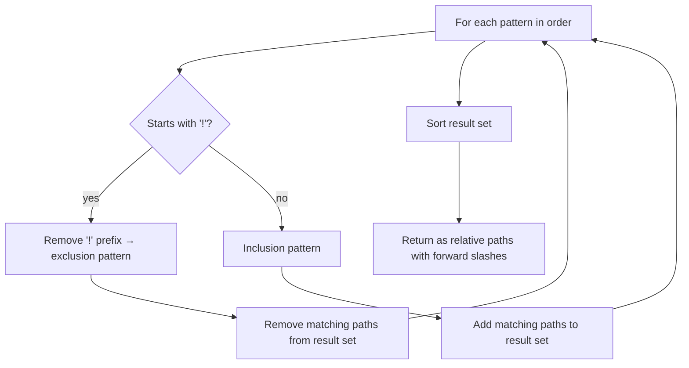

# GlobMatcher

## Purpose

The `GlobMatcher` software unit resolves an ordered list of glob patterns into a
concrete, sorted list of file paths relative to a base directory. It provides the
file enumeration primitive used by the Configuration subsystem to expand the
`needs-review` and `review-set` file lists defined in `.reviewmark.yaml`.

## Algorithm

`GlobMatcher.GetMatchingFiles(baseDirectory, patterns)` processes patterns in the
order they are declared. Each pattern is evaluated as follows:

Patterns are evaluated against the base directory using standard glob semantics.
The `**` wildcard matches any number of path segments (recursive matching).

## Return Value

The method returns a sorted list of relative file paths. Path separators are
normalized to forward slashes regardless of the host operating system, ensuring
consistent fingerprint computation across platforms.

## Usage

`GlobMatcher.GetMatchingFiles()` is called by `ReviewMarkConfiguration` to resolve:

- The `needs-review` file list, which represents all files subject to review
- Each `review-set` file list, which represents the files covered by a specific review record
