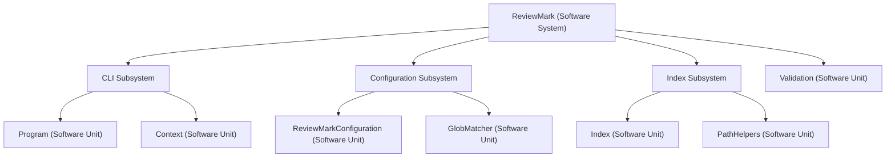

# Introduction

This document describes the software design for the ReviewMark project.

## Purpose

ReviewMark is a .NET command-line tool for automated file-review evidence management
in regulated environments. It computes cryptographic fingerprints of defined file-sets,
queries a review evidence store for corresponding review records, and produces compliance
documents on each CI/CD run.

This design document describes the internal architecture, subsystems, and software units
that together implement the ReviewMark tool. It is intended to support development,
review, and maintenance activities.

## Scope

This design document covers:

- The software system decomposition into subsystems and software units
- The responsibilities and interfaces of each software unit
- The algorithms and data flows used for fingerprinting, evidence lookup, and document generation
- The self-validation framework

This document does not cover:

- External CI/CD pipeline configuration
- Evidence store setup or administration
- Requirements traceability (see the Requirements Specification)

## Software Architecture

The following diagram shows the decomposition of the ReviewMark software system into
subsystems and software units.

## Audience

This document is intended for:

- Software developers working on ReviewMark
- Quality assurance teams performing design verification
- Project stakeholders reviewing architectural decisions
