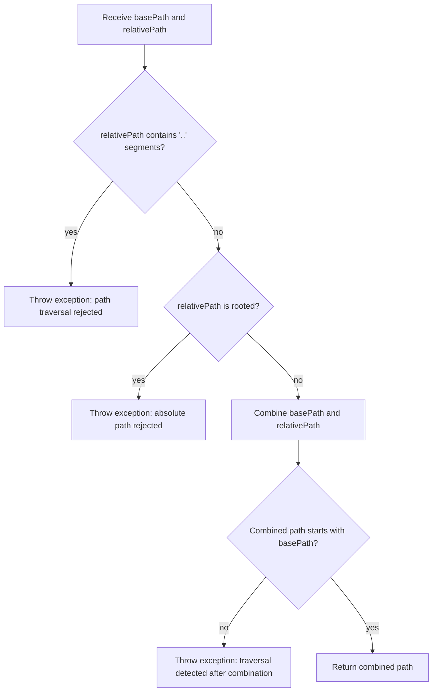

# PathHelpers

## Purpose

The `PathHelpers` software unit provides safe path construction utilities that
prevent path traversal attacks. It is used by the Index subsystem when constructing
file system paths to evidence PDF files referenced in the evidence index.

## SafePathCombine()

`PathHelpers.SafePathCombine(basePath, relativePath)` combines a trusted base path
with an untrusted relative path from the evidence index, validating that the result
does not escape the base directory.

The algorithm is:

The double-check strategy (pre-validation of segments plus post-combination
verification) defends against edge cases such as URL-encoded separators or
platform-specific path normalization that might otherwise bypass a single check.

## Security Rationale

Evidence index files may be loaded from external sources (file shares or URLs).
The `file` field in each index record is supplied by the evidence store and must
be treated as untrusted input. Without path validation, a maliciously crafted
index could direct the tool to read or reference files outside the intended
evidence directory. `SafePathCombine` eliminates this attack surface.
