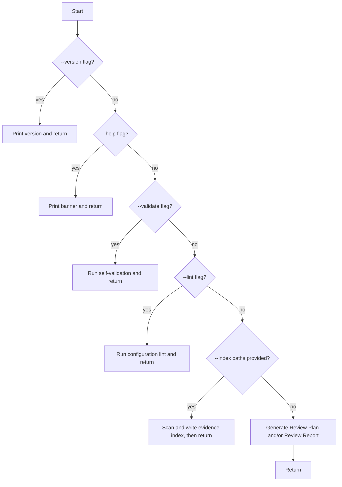

# Program

## Purpose

The `Program` software unit is the main entry point of the ReviewMark tool. It is
responsible for constructing the execution context, dispatching to the appropriate
processing logic based on parsed flags, and returning a meaningful exit code to the
calling process.

## Version Property

`Program.Version` returns the tool version string. The version is embedded at build
time from the assembly metadata and follows semantic versioning conventions.

## Main() Method

`Program.Main(string[] args)` is the process entry point. It:

1. Constructs a `Context` instance via `Context.Create(args)` inside a `using` block
2. Calls `Program.Run(Context)` to perform the requested operation
3. Returns `Context.ExitCode` as the process exit code

Any unhandled exception that escapes `Run()` is caught, written to the error output
via `Context.WriteError()`, and causes a non-zero exit code to be returned.

## Run() Dispatch Logic

`Program.Run(Context)` evaluates the parsed flags in the following priority order,
executing the first matching action and returning:

Only one top-level action is performed per invocation. Actions later in the priority
order are not reached if an earlier flag is set.

## PrintBanner()

`Program.PrintBanner(Context)` writes the help text to the console via
`Context.WriteLine()`. The banner lists all supported flags and arguments with brief
descriptions.
