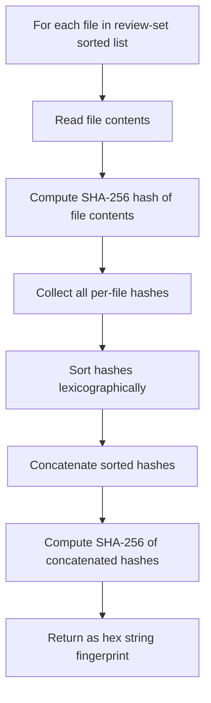

# ReviewMarkConfiguration

## Purpose

The `ReviewMarkConfiguration` software unit is responsible for parsing the
`.reviewmark.yaml` configuration file and performing all review-set processing.
It coordinates file enumeration, fingerprint computation, evidence lookup, and
the generation of the Review Plan and Review Report compliance documents.

## Configuration Model

The `.reviewmark.yaml` file is deserialized into the following model:

| Class | Description |
| ----- | ----------- |
| `ReviewMarkYaml` | Root configuration object containing the evidence source and review list |
| `EvidenceSourceYaml` | Describes how to locate the evidence index (`type`, `location`, optional `credentials`) |
| `ReviewYaml` | Describes a single review-set (`id`, `title`, file patterns) |

## ReviewMarkConfiguration.Load()

`ReviewMarkConfiguration.Load(definitionFile, workingDirectory)` reads and
deserializes the YAML file, resolves all glob patterns relative to the working
directory, computes fingerprints for each review-set, loads the evidence index,
and returns a fully initialized configuration object ready for plan/report generation.

## Fingerprinting Algorithm

The fingerprint for a review-set uniquely identifies the exact content of its file-set.
The algorithm is:

Sorting the per-file hashes before combining them ensures that the fingerprint is
sensitive to content changes but not to the order in which files happen to be
enumerated by the operating system.

## Review Plan Generation

The Review Plan is generated by `ReviewMarkConfiguration.WritePlan()`. It produces
a Markdown document that lists every file in the `needs-review` file-set and, for
each file, identifies which review-sets provide coverage.

- The `--plan-depth` argument controls the heading level used for sections
- The `--elaborate` flag expands the file list for each review-set inline

## Review Report Generation

The Review Report is generated by `ReviewMarkConfiguration.WriteReport()`. It
produces a Markdown document that lists every review-set with its current status.

For each review-set the report includes:

- The review-set `id` and `title`
- The current fingerprint of the file-set
- The review status: `Current`, `Stale`, `Missing`, or `Failed`

Status is computed by `ReviewMarkConfiguration.PublishReviewReport(...)`, which uses the loaded evidence index to determine whether the current fingerprint has a passing, failing, stale, or missing review result.

- The `--report-depth` argument controls the heading level used for sections
- The `--elaborate` flag expands the list of files covered by each review-set

## Linting

`ReviewMarkConfiguration.Lint(Context)` validates the loaded configuration for
correctness. Lint checks include:

- All review-set `id` values are unique
- All glob patterns resolve to at least one file
- The `needs-review` file-set is non-empty
- All files in the `needs-review` set are covered by at least one review-set
