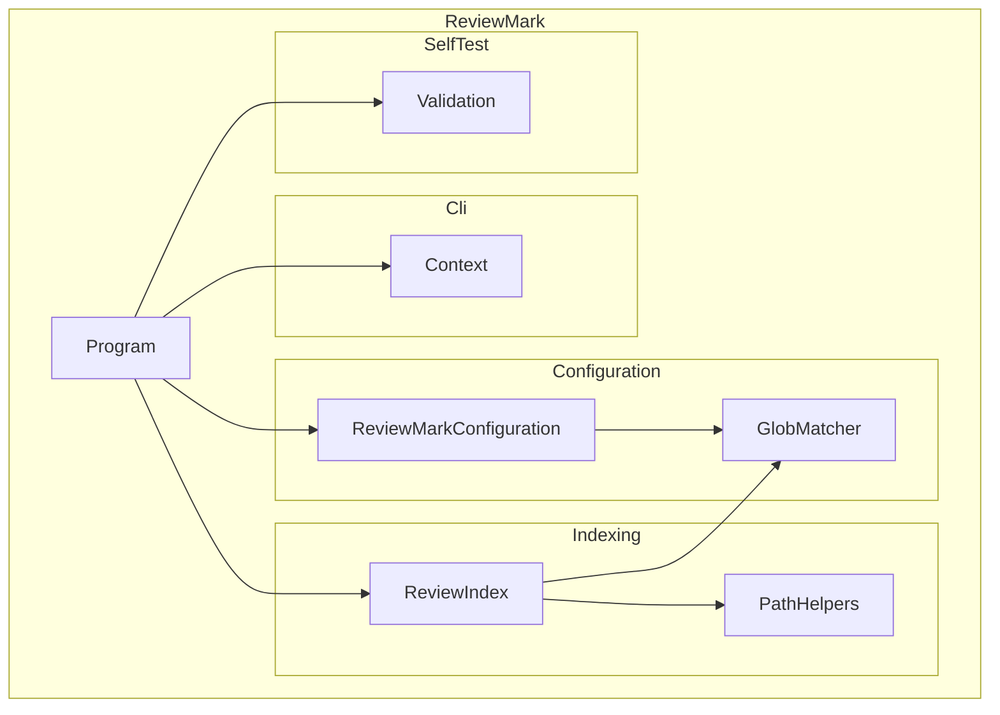

# ReviewMark

ReviewMark is a .NET command-line tool for automated file-review evidence management in
regulated environments. It determines which files are subject to review, identifies the
review evidence that covers them, and generates Review Plan and Review Report compliance
documents.

## Architecture

ReviewMark is organized as a single system composed of four subsystems and one standalone
unit:

| Item | Category | Responsibility |
| ---- | -------- | -------------- |
| Program | Unit | Process entry point; constructs the execution context and dispatches to subsystems |
| Cli | Subsystem | Command-line argument parsing and output channel ownership |
| Configuration | Subsystem | YAML configuration loading, validation, and review-set processing |
| Indexing | Subsystem | Review evidence loading, PDF scanning, and safe path utilities |
| SelfTest | Subsystem | Built-in self-validation test suite |

There is no system-level source code beyond `Program.cs`; all processing logic resides
within the subsystems. `Program.Main()` creates a `Context` instance and delegates all
work through `Program.Run()`, which dispatches to the appropriate subsystem based on the
parsed command-line flags.

`Program.Run()` evaluates parsed flags in a fixed priority order: `--version` first, then
the application banner, then `--help`, then `--validate`, then `--lint`, and finally the
main tool logic. This ensures that diagnostic flags are always handled before
output-generating actions. Each operational mode is described below.

**Review Plan and Report Generation**: When `--plan` and/or `--report` are supplied,
ReviewMark loads the definition file, resolves file lists, loads the evidence index, and
generates the requested documents. The `--enforce` flag can be combined with this mode to
exit non-zero when issues are detected.

**Elaborate Mode (`--elaborate`)**: When `--elaborate <id>` is supplied, ReviewMark looks
up the named review-set and writes a Markdown elaboration to stdout containing the
review-set ID, title, current fingerprint, and the full sorted list of matched files. This
mode does not query the evidence store.

**Lint Mode (`--lint`)**: When `--lint` is supplied, ReviewMark loads and validates the
definition file in a single pass, collecting all detectable structural and semantic issues.
The application banner is suppressed. Silence means the definition file is valid.

**Validate Mode (`--validate`)**: When `--validate` is supplied, ReviewMark runs a
built-in self-test suite that exercises core tool behaviors and produces a pass/fail
summary, optionally writing results to a TRX or JUnit XML file via `--results`.

**Version Mode (`--version`)**: Writes only the version string to stdout and exits.

**Help Mode (`--help`)**: Writes the usage message listing all supported flags to stdout.

## External Interfaces

**Command-Line Interface**: The sole external interface of the ReviewMark system. All
inputs are supplied as command-line arguments to the `reviewmark` executable; all outputs
are written to stdout, stderr, and optionally to files. There is no network listener, REST
API, or graphical interface.

- *Type*: CLI (command-line interface)
- *Role*: Provider — the ReviewMark executable is invoked by users and CI/CD pipelines
- *Contract*: The following flags are recognized:

| Flag | Description |
| ---- | ----------- |
| `--version` / `-v` | Display version string and exit |
| `--help` / `-?` / `-h` | Display usage information and exit |
| `--silent` | Suppress all console output; exit code still signals success or failure |
| `--lint` | Validate the definition file; print only issues; exit non-zero on failure |
| `--validate` | Run built-in self-validation tests |
| `--results <file>` | Write validation results to a TRX or JUnit XML file (with `--validate`) |
| `--log <file>` | Write all output to a persistent log file in addition to stdout |
| `--depth <#>` | Default Markdown heading depth (1–5) for all generated documents; default 1 |
| `--dir <directory>` | Set the working directory for default paths and glob scanning |
| `--definition <file>` | Override the default `.reviewmark.yaml` configuration file path |
| `--plan <file>` | Generate a Markdown review-plan document listing all review sets |
| `--plan-depth <#>` | Override the Markdown heading depth for the plan document |
| `--report <file>` | Generate a Markdown review-report document summarizing review-set completion |
| `--report-depth <#>` | Override the Markdown heading depth for the report document |
| `--elaborate <id>` | Print a Markdown elaboration for the named review set |
| `--enforce` | Exit with code 1 if the plan has uncovered files or any review-set is non-current |
| `--index <pattern>` | Scan PDF evidence files matching the glob pattern and write `index.json`; repeatable |

- *Constraints*: Exit code 0 always means success; exit code 1 always means failure or
  enforcement violation. Unrecognized arguments cause the process to exit with code 1 and
  write a descriptive error to stderr.

## Dependencies

ReviewMark depends on the following OTS software items:

- **YamlDotNet**: YAML deserialization used by the Configuration subsystem to parse
  `.reviewmark.yaml` — see *YamlDotNet Integration Design*
- **PDFsharp**: PDF document reading used by the Indexing subsystem to extract metadata
  from evidence PDF files — see *PDFsharp Integration Design*
- **DemaConsulting.TestResults**: TRX and JUnit XML test-results serialization used by the
  SelfTest subsystem — see *DemaConsulting.TestResults Integration Design*
- **Microsoft.Extensions.FileSystemGlobbing**: glob-pattern file matching used by the
  `GlobMatcher` unit in the Configuration subsystem — see
  *Microsoft.Extensions.FileSystemGlobbing Integration Design*

No shared packages are used.

## Risk Control Measures

N/A — ReviewMark is a standalone command-line tool that runs in a single process with no
concurrent threads beyond those managed by the .NET runtime. There are no software items
that require runtime segregation for risk control. The evidence store is read-only during
normal operation; the only files written by the tool are the output documents and, when
`--index` is used, `index.json`.

## Data Flow

The high-level data flow through the ReviewMark system:

1. **Input**: `string[] args` from the OS shell → parsed by `Context.Create()` into
   structured flags and paths.
2. **Configuration**: `ReviewMarkConfiguration.Load()` reads `.reviewmark.yaml` from disk,
   parses and validates the YAML structure, and resolves relative fileshare paths. Glob
   pattern resolution against the file system is performed later, in `PublishReviewPlan`,
   `PublishReviewReport`, and `ElaborateReviewSet`, each of which calls `GlobMatcher` to
   enumerate the matching files at generation time.
3. **Evidence**: `ReviewIndex.Load()` reads or downloads the evidence index, populating an
   in-memory lookup keyed by `(id, fingerprint)`. Three source types are supported:
   `none` (empty index), `fileshare` (local or network file-path read), and `url` (HTTP or
   HTTPS download, with optional Basic-auth credentials from environment variables).
4. **Processing**: `PublishReviewPlan()` or `PublishReviewReport()` combines the resolved
   file lists with the evidence index to compute status and generate Markdown output.
   The Review Plan lists every file subject to review and which review-sets cover it.
   The Review Report lists every review-set with status: Current, Stale, Missing, or Failed.
5. **Output**: Generated Markdown is written to files on disk; status messages and errors
   are written to stdout/stderr via `Context`.

For the `--index` workflow, the flow is: glob patterns → `GlobMatcher` → sorted PDF paths
→ `ReviewIndex.Scan()` → PDF metadata extraction → serialized `index.json`.

For `--elaborate`, the flow is: review-set ID → configuration lookup → Markdown
elaboration (ID, title, fingerprint, file list) written to stdout.

When `--enforce` is set, a non-zero exit code is returned if the Review Plan shows any
uncovered files, or if the Review Report shows any review-set has a status other than
Current (i.e., is Stale, Missing, or Failed).

## Design Constraints

- **Platform**: targets .NET 8, .NET 9, and .NET 10; runs on Windows, macOS, and Linux
- **Distribution**: distributed as a .NET global tool via NuGet; no external runtime
  dependencies beyond the .NET SDK
- **Output format**: all generated documents are Markdown; no binary output is produced
  except `index.json` written by `--index`
- **No GUI**: the sole external interface is the command-line; no interactive or graphical
  interface is provided
- **Deterministic fingerprints**: the SHA-256 fingerprint algorithm is content-based and
  platform-independent so that the same files produce the same fingerprint on any operating
  system; fingerprints are stable across renames or moves that keep the same set of file
  contents, and change only when file content changes
- **Exit code semantics**: exit code 0 always means success; exit code 1 always means
  failure or enforcement violation; no other exit codes are used
