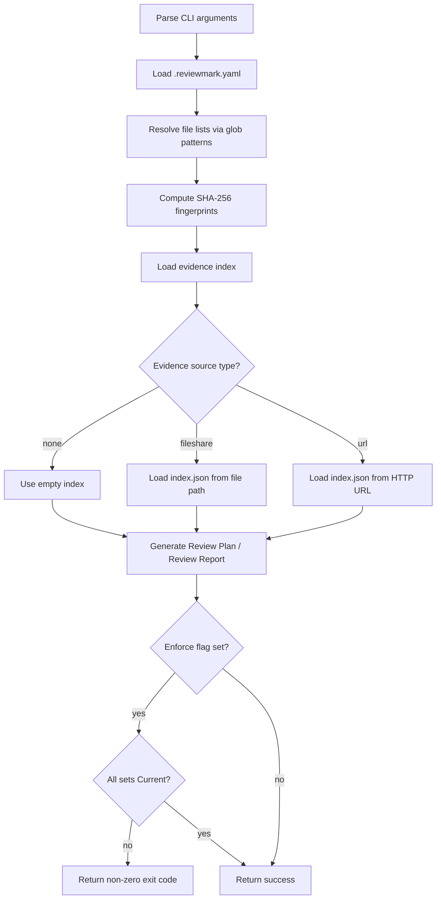

# System Design

This section describes the high-level behavior of the ReviewMark system and the workflow
that connects its subsystems.

## Overview

ReviewMark automates the evidence-gathering step of software review processes used in
regulated environments. On each CI/CD run, it determines which files are subject to
review, identifies the review evidence that covers them, and generates two compliance
documents: a Review Plan and a Review Report.

## Main Workflow

The following diagram illustrates the end-to-end processing flow.

## Evidence Source Types

ReviewMark supports three evidence source types, configured in `.reviewmark.yaml`:

| Source Type | Description |
| ----------- | ----------- |
| `none` | No evidence store; all review-sets are treated as missing |
| `fileshare` | Evidence index loaded from a local or network file path |
| `url` | Evidence index loaded from an HTTP or HTTPS URL |

## Output Documents

### Review Plan

The Review Plan lists every file that is subject to review and identifies which
review-sets provide coverage for each file. It is generated by the `--plan` flag
and written to a configurable output path.

### Review Report

The Review Report lists every review-set defined in the configuration, the current
fingerprint of its file-set, and the review status (Current, Stale, or Missing).
It is generated by the `--report` flag and written to a configurable output path.

## Enforcement

When the `--enforce` flag is set, ReviewMark returns a non-zero exit code if any
review-set does not have Current status. This allows CI/CD pipelines to fail builds
when review coverage is incomplete or out of date.

## Index Management

The `--index` flag causes ReviewMark to scan a directory for PDF evidence files and
write an `index.json` file suitable for use as a fileshare evidence source. This
supports workflows where review PDFs are stored alongside source code or on a
shared network location.
